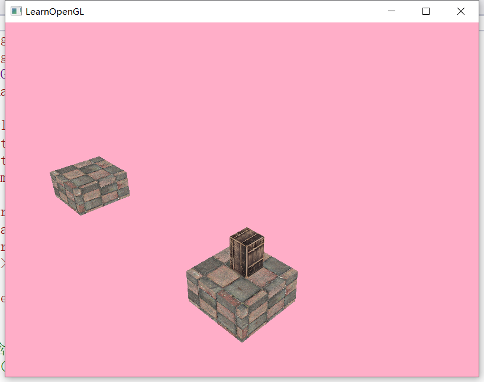

# OpenGLJump
大二时采用glad和glfw制作的跳一跳，采用glm库来进行矩阵运算。 
箱子和地板采用着色器绘制。 
跳跃时轨迹采用抛物线，且箱子会自转 
地板会一左一右自动生成，落地时镜头跟随至新地板。 
 
An OpenGL project using glad, glfw, glm libraries and built by C++. 
Click the screen for a long time, the longer you click the screen, the farther the box jump. 
Jump to more platform to get a higher score! 
If you are using windows, you can download Release/project.zip to execute this project on your computer. 

